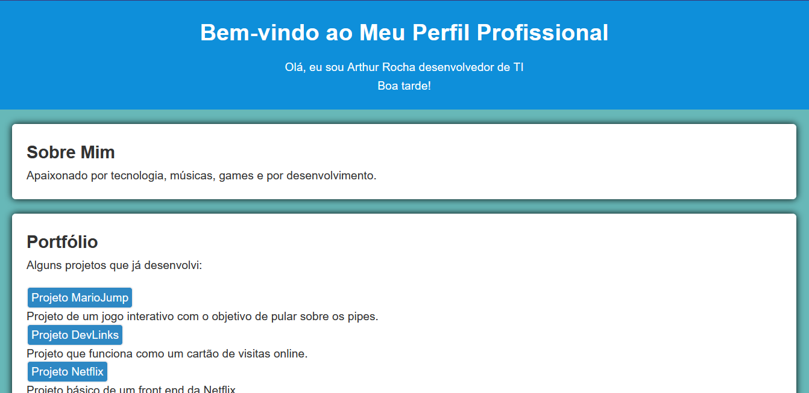

<h1 align="center"> Landing page </h1>

A landing page foi criada como uma atividade da faculdade e tem como objetivo ser um portfólio online para exibir meus trabalhos. 

  <a href="#-tecnologias">Tecnologias</a>&nbsp;&nbsp;&nbsp;|&nbsp;&nbsp;&nbsp;
  <a href="#-projeto">Projeto</a>&nbsp;&nbsp;&nbsp;|&nbsp;&nbsp;&nbsp;
  <a href="#-layout">Layout</a>&nbsp;&nbsp;&nbsp;|&nbsp;&nbsp;&nbsp;
  <a href="#memo-licença">Licença</a>

  

 

  

## 🚀 Tecnologias

Esse projeto básico foi desenvolvido com as seguintes tecnologias:

- HTML e CSS
- Javascript
- Git e Github

## 💻 Projeto

 A página é projetada para ser visualmente atraente e funcional, facilitando a navegação entre diferentes seções e fornecendo informações detalhadas sobre cada projeto.

## 💡 Licença

Esse projeto está sob a licença MIT.

---

Feito com ♥ by ArthurDev.